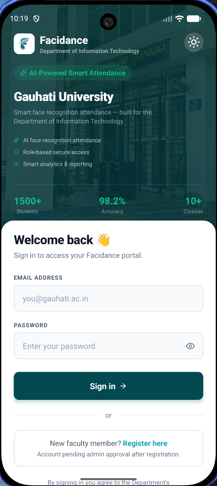
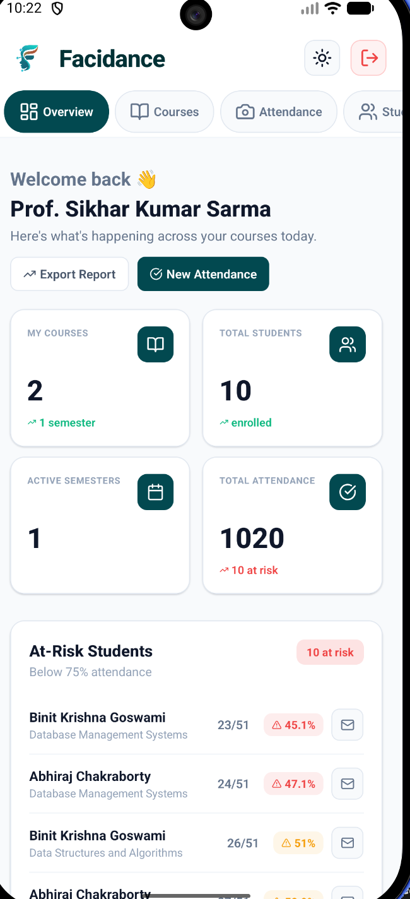
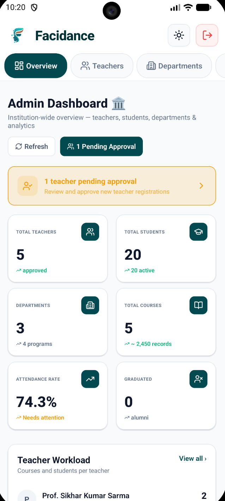
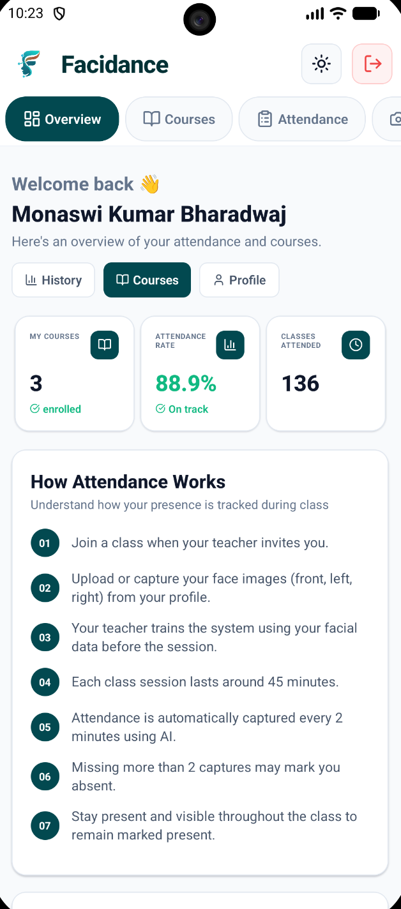
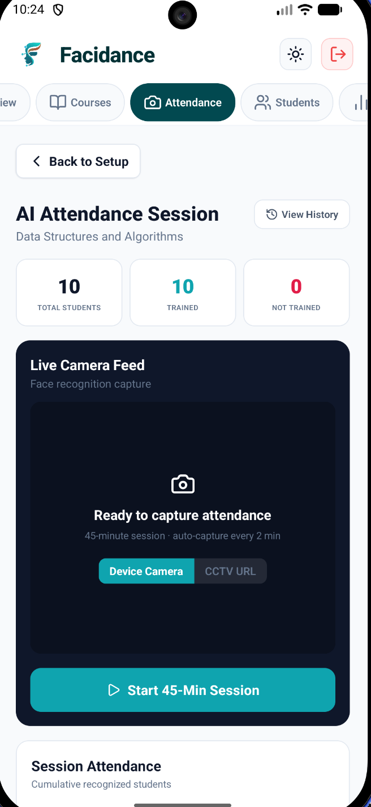
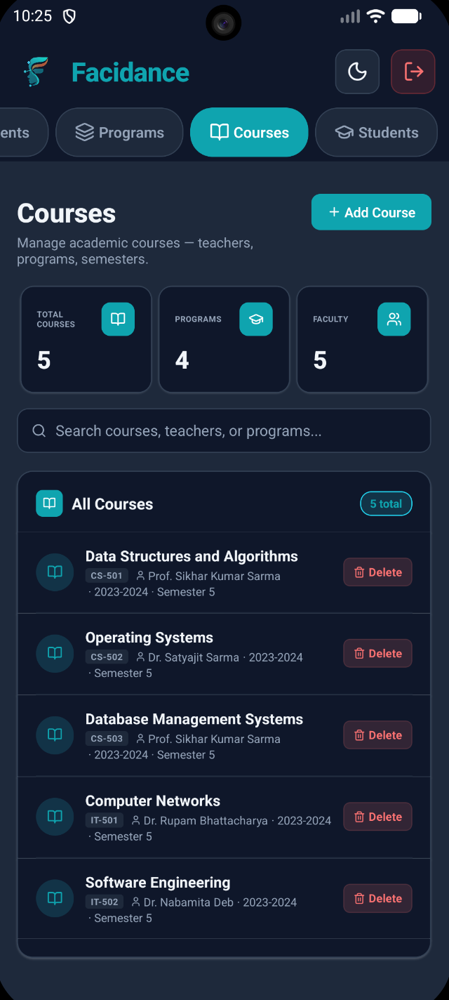

<p align="center">
  
</p>

<h1 align="center">Facidance Mobile</h1>

<p align="center">
  <b>AI-Powered Face Recognition Attendance System</b><br/>
  Built for Gauhati University · Department of Information Technology
</p>

<p align="center">
  
  
  
  
</p>

---

## ✨ Overview

**Facidance Mobile** is a cross-platform mobile application that brings AI-powered face recognition attendance to classrooms. Teachers can start live camera sessions that automatically capture and recognize students every 2 minutes using deep learning face embeddings. Students can view their attendance history, and admins can manage the entire institution from their phone.

The app features a premium, dark-mode-ready design with smooth animated transitions, skeleton loaders, branded pull-to-refresh, and illustrated empty states.

---

## 📱 Screenshots

<p align="center">
  
  &nbsp;&nbsp;
  
  &nbsp;&nbsp;
  
</p>

<p align="center">
  
  &nbsp;&nbsp;
  
  &nbsp;&nbsp;
  
</p>

<p align="center">
  <sub>Login Screen &nbsp;&nbsp;&nbsp;&nbsp;&nbsp;&nbsp;&nbsp;&nbsp;&nbsp;&nbsp;&nbsp;&nbsp;&nbsp;&nbsp;&nbsp;&nbsp;&nbsp;&nbsp;&nbsp;&nbsp;&nbsp;&nbsp;&nbsp; Teacher Dashboard &nbsp;&nbsp;&nbsp;&nbsp;&nbsp;&nbsp;&nbsp;&nbsp;&nbsp;&nbsp;&nbsp;&nbsp;&nbsp;&nbsp;&nbsp;&nbsp;&nbsp;&nbsp;&nbsp; Admin Dashboard</sub>
</p>
<p align="center">
  <sub>Student Dashboard &nbsp;&nbsp;&nbsp;&nbsp;&nbsp;&nbsp;&nbsp;&nbsp;&nbsp;&nbsp;&nbsp;&nbsp;&nbsp;&nbsp;&nbsp;&nbsp;&nbsp; Attendance Session &nbsp;&nbsp;&nbsp;&nbsp;&nbsp;&nbsp;&nbsp;&nbsp;&nbsp;&nbsp;&nbsp;&nbsp;&nbsp;&nbsp;&nbsp;&nbsp;&nbsp;&nbsp;&nbsp;&nbsp; Dark Theme</sub>
</p>

---

## 🎯 Features

### 🎓 Student Portal
- **Face Profile Upload** — Upload front, left, and right face photos for AI model training
- **Attendance History** — View detailed per-course attendance records with date-wise breakdowns
- **Course Dashboard** — Browse enrolled courses with attendance rate indicators
- **Attendance Insights** — Visual progress bars, tips, and overall rate tracking
- **CSV Export** — Download attendance records as spreadsheets

### 👨‍🏫 Teacher Portal
- **Live Attendance Camera** — Start 45-minute sessions with automatic frame capture every 2 minutes
- **AI Face Recognition** — Trained models recognize students in real-time via the backend
- **Student Enrollment** — Manage students per course with bulk CSV/Excel import
- **Attendance Reports** — Date-range filtered analytics with charts and email notifications
- **At-Risk Alerts** — Automatic identification of students below 75% attendance
- **Course Management** — View course details, student lists, and session history

### 🏛 Admin Portal
- **Institution Dashboard** — Unified overview: teachers, students, departments, courses, attendance rates
- **Teacher Approval** — Review and approve/reject new teacher registrations
- **Student Management** — Track active/graduated students across programs
- **Department & Program Management** — Full CRUD for academic structure
- **Course Management** — Create, edit, and assign courses with teacher/student mappings
- **Teacher Workload Analytics** — Visualize course load and student counts per teacher
- **Program Distribution** — Bar charts showing enrollment across programs

---

## 🛠 Tech Stack

| Category | Technology |
|---|---|
| **Framework** | React Native 0.84.1 (New Architecture / Fabric) |
| **Navigation** | React Navigation 7.x (Native Stack + Bottom Tabs) |
| **State** | Redux Toolkit + React Redux |
| **Icons** | Lucide React Native |
| **Camera** | React Native Camera Kit |
| **File System** | React Native FS |
| **Image Handling** | React Native Image Picker + Custom Disk Caching |
| **Data Export** | XLSX + React Native Share |
| **Haptics** | React Native Haptic Feedback |
| **Date Picker** | @react-native-community/datetimepicker |
| **Storage** | @react-native-async-storage/async-storage |
| **Backend** | FastAPI (Python) + Prisma ORM + PostgreSQL (NeonDB) |

---

## 📁 Project Structure

```
Facidance_Mobile/
├── src/
│   ├── api/                    # API client, endpoints & auth storage
│   │   ├── adminApi.js         # Admin endpoints (stats, CRUD, analytics)
│   │   ├── teacherApi.js       # Teacher endpoints (courses, attendance, reports)
│   │   ├── studentApi.js       # Student endpoints (history, profile, courses)
│   │   ├── authStorage.js      # AsyncStorage token management
│   │   └── config.js           # Base URL configuration
│   │
│   ├── assets/                 # Logo, images, static resources
│   │
│   ├── components/             # Reusable UI components
│   │   ├── BrandedRefresh.js   # Themed pull-to-refresh with brand color cycle
│   │   ├── CachedImage.js      # Disk-cached image loader with placeholders
│   │   ├── EmptyState.js       # Animated empty states (5 variants)
│   │   ├── ErrorBoundary.js    # Global error boundary with recovery UI
│   │   └── SkeletonLoader.js   # Content-aware skeleton loading screens
│   │
│   ├── navigation/             # Navigation structure
│   │   ├── RootNavigator.js    # Auth check → role-based routing
│   │   ├── AuthNavigator.js    # Login / Register stack
│   │   ├── AdminTabs.js        # Admin bottom tabs with custom header
│   │   ├── TeacherTabs.js      # Teacher bottom tabs + nested stacks
│   │   └── StudentTabs.js      # Student bottom tabs + nested stacks
│   │
│   ├── screens/
│   │   ├── auth/               # LoginScreen, RegisterScreen
│   │   ├── admin/              # AdminDashboard, Teachers/Students/
│   │   │                       # Departments/Programs/Courses Management
│   │   ├── teacher/            # TeacherDashboard, MyCourses, AttendanceCamera,
│   │   │                       # AttendanceSession, CourseDetails, StudentEnrollment,
│   │   │                       # AttendanceReport
│   │   └── student/            # StudentDashboard, MyCourses, CourseAttendance,
│   │                           # AttendanceHistory, ProfileUpload
│   │
│   ├── theme/
│   │   └── Theme.js            # Light/Dark/System theme with full color palette
│   │
│   └── utils/
│       ├── haptics.js          # Haptic feedback utility (light, medium, warning)
│       └── imageCompressor.js  # Image resize/compress before upload
│
├── android/                    # Android native project
├── ios/                        # iOS native project (Xcode workspace)
└── App.tsx                     # Root component with Redux + Navigation providers
```

---

## 🚀 Getting Started

### Prerequisites

- **Node.js** ≥ 22.11.0
- **npm** or **yarn**
- **React Native CLI** (`npx react-native`)
- **Android Studio** with Android SDK 36 (for Android)
- **Xcode** 16+ (for iOS — macOS only)
- **Backend server** running ([Facidance Backend](https://github.com/Monaswi0104/Facidance))

### Installation

```bash
# 1. Clone the repository
git clone https://github.com/Monaswi0104/Facidance_Mobile.git
cd Facidance_Mobile

# 2. Install dependencies
npm install

# 3. iOS only — install CocoaPods
cd ios && bundle install && bundle exec pod install && cd ..

# 4. Configure API endpoint
# Edit src/api/config.js and set your backend URL
```

### Running the App

```bash
# Start Metro bundler
npm start

# Android (in a separate terminal)
npm run android

# iOS (in a separate terminal — macOS only)
npm run ios
```

### Environment Setup

| Variable | Description | Example |
|---|---|---|
| API Base URL | Backend server address | `http://10.0.2.2:8000` (Android emulator) |
| | | `http://localhost:8000` (iOS simulator) |

> **Note:** For physical devices, use your machine's local IP address (e.g., `http://192.168.x.x:8000`).

---

## 🎨 Design System

The app uses a comprehensive design token system supporting **Light**, **Dark**, and **System** themes:

| Token | Light | Dark |
|---|---|---|
| `primary` | `#024950` | `#0FA4AF` |
| `background` | `#ffffff` | `#0f172a` |
| `foreground` | `#0f172a` | `#f1f5f9` |
| `accent` | `#0FA4AF` | `#22d3ee` |
| `success` | `#10b981` | `#34d399` |
| `destructive` | `#ef4444` | `#f87171` |

### UI Components

- **BrandedRefresh** — Pull-to-refresh with animated brand color cycling (Teal → Cyan → Green)
- **EmptyState** — 5 animated variants with floating icons, pulsing rings, and CTAs
- **SkeletonLoader** — Content-aware loading skeletons matching each screen's layout
- **CachedImage** — Disk-cached image loading with placeholder states and offline support

### Navigation Transitions

- `slide_from_right` — Standard horizontal navigation (list → detail)
- `fade_from_bottom` — Modal/detail views (dashboard → deep content)
- Gesture-disabled on dashboard screens to prevent accidental navigation

---

## 🔐 Authentication Flow

```
App Launch
   │
   ├─ Token exists? ─── Yes ──→ Validate role ──→ Admin/Teacher/Student Dashboard
   │
   └─ No ──→ Login Screen
                  │
                  ├─ Teacher login ──→ Teacher Dashboard (bottom tabs)
                  ├─ Student login ──→ Student Dashboard (bottom tabs)
                  └─ Admin login ──→ Admin Dashboard (bottom tabs)
```

- JWT tokens stored securely via `AsyncStorage`
- Automatic role-based routing on app launch
- Session persistence across app restarts

---

## 📊 AI Attendance Workflow

```
Teacher starts session (45 min)
        │
        ├─ Camera opens with live feed
        │
        ├─ Every 2 minutes:
        │     ├─ Frame captured automatically
        │     ├─ Sent to backend for face recognition
        │     ├─ Recognized students marked present (cumulative)
        │     └─ UI updates with real-time results
        │
        └─ Session ends → Final attendance submitted
```

- Uses the same API endpoints as the web platform for full feature parity
- Face models are trained per-course using uploaded student profile photos
- Recognition results accumulate — once marked present, a student stays present

---

## 🤝 Contributing

1. Fork the repository
2. Create a feature branch (`git checkout -b feature/amazing-feature`)
3. Commit your changes (`git commit -m 'Add amazing feature'`)
4. Push to the branch (`git push origin feature/amazing-feature`)
5. Open a Pull Request

---

## 📝 License

This project is licensed under the **MIT License**.

## 👨‍💻 Author

**Monaswi** — [@Monaswi0104](https://github.com/Monaswi0104)

## 🙏 Acknowledgments

- **Gauhati University**, Department of Information Technology
- React Native & open-source community
- All contributors and testers

---

<p align="center">
  <b>Facidance</b> — Smart Attendance, Smarter Classrooms 🎓
</p>
